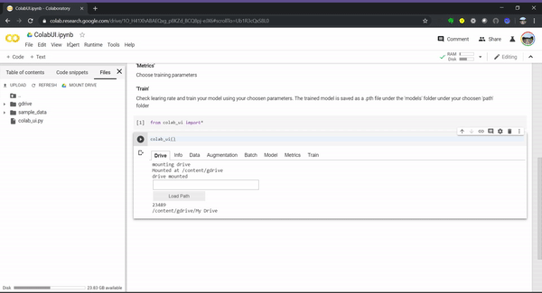

# Colab_UI
UI interface using fastai(version 1) compatible with Google Colab

  

[]

Colab_UI is based on [Vision_UI](https://github.com/asvcode/Vision_UI) and adds a graphical user interface to [fastai](https://www.fast.ai/) allowing the user to quickly load, choose parameters, train and view results without the need to dig deep into the code.

### How to Use:
1) Click here to open in Colab 

### Issues:
- To minimize errors please ensure you are using `torch==1.4` and `torchvision==0.5.0`
These can be loaded using:
`!pip install "torch==1.4" "torchvision==0.5.0"`
